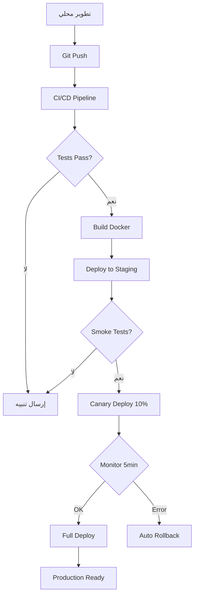

# 🚀 خطة التطوير - SmartEdu Production Ready

## 📋 النظرة العامة

هذا الدليل يحتوي على خطة كاملة لتحويل SmartEdu إلى نظام **Production-Ready 100%** مع جميع المعايير الصناعية.

---

## 🎯 الأهداف الرئيسية

```
✅ CI/CD Pipeline آلي كامل
✅ إدارة أسرار احترافية (Vault)
✅ Backup & Disaster Recovery
✅ Load Testing & Performance
✅ SLA/SLO Monitoring
✅ Log Management
✅ Privacy & Compliance
✅ Production Deployment
```

---

## 📊 الإحصائيات

| المقياس | القيمة الحالية | الهدف |
|---------|----------------|--------|
| **Readiness** | 90% | 100% |
| **Uptime** | - | 99.9% |
| **Response Time** | - | <500ms (p95) |
| **Error Rate** | - | <0.1% |
| **Test Coverage** | - | >80% |
| **Security Score** | - | A+ |

---

## 📁 هيكل الوثائق

```
docs/
├── README.md (فهرس الملفات)
├── QUICK_START.md (دليل البدء السريع)
├── PRODUCTION_READY_PLAN.md (هذا الملف)
├── 01_CI_CD_PIPELINE.md (مفصل - CI/CD)
├── 02_SECRETS_MANAGEMENT.md (مفصل - Vault)
├── 03-07_COMPLETE_GUIDE.md (دليل شامل: Backup, Testing, SLA, Logs, Privacy)
└── 08_DEPLOYMENT_CHECKLIST.md (Checklist نهائي)
```

---

## 🗓️ الجدول الزمني

### **المرحلة 1: Infrastructure (أسبوع 1-2)**
```
□ اليوم 1-2:  CI/CD Pipeline Setup
□ اليوم 3-4:  Secrets Management (Vault)
□ اليوم 5-7:  Backup & DR Setup
□ اليوم 8-10: Testing Setup
```

### **المرحلة 2: Monitoring & Security (أسبوع 3)**
```
□ اليوم 11-13: SLA/SLO Monitoring
□ اليوم 14-15: Log Management
□ اليوم 16-17: Privacy & Compliance
```

### **المرحلة 3: Testing & Deployment (أسبوع 4)**
```
□ اليوم 18-19: Load Testing
□ اليوم 20-21: Security Audit
□ اليوم 22-23: Staging Deployment
□ اليوم 24-25: Production Deployment
```

---

## 🔄 سير العمل



---

## 📝 الترتيب الموصى به

### **1️⃣ أولوية عالية (يجب تنفيذها أولاً)**
- [البدء السريع](./QUICK_START.md) - دليل سريع للبدء
- [01 - CI/CD Pipeline](./01_CI_CD_PIPELINE.md) - مفصل وجاهز للتطبيق
- [02 - Secrets Management](./02_SECRETS_MANAGEMENT.md) - Vault setup

### **2️⃣ أولوية متوسطة (أساسية للإنتاج)**
- [03-07 - الدليل الشامل](./03-07_COMPLETE_GUIDE.md) - يحتوي على:
  - Backup & Disaster Recovery
  - Load Testing (K6)
  - SLA/SLO Monitoring
  - Log Retention (Loki)
  - Privacy & Compliance

### **3️⃣ أولوية قبل الإطلاق**
- [08 - Deployment Checklist](./08_DEPLOYMENT_CHECKLIST.md) - Checklist نهائي قبل النشر

---

## 🎯 معايير النجاح

### **Technical Metrics**
```yaml
ci_cd:
  automated_tests: true
  deployment_time: <10 minutes
  rollback_time: <2 minutes
  
security:
  secrets_encrypted: true
  vault_rotation: every 30 days
  ssl_grade: A+
  
reliability:
  uptime: 99.9%
  backup_frequency: daily
  restore_tested: monthly
  
performance:
  api_latency_p95: <500ms
  ai_evaluation_p95: <3s
  error_rate: <0.1%
```

---

## 💰 التكلفة المتوقعة

```
AI (Gemini Pro):          4.28 ريال/شهر
VPS (Hetzner):           2.00 ريال/شهر
Object Storage (Wasabi): 0.01 ريال/شهر
Backups (S3):           0.30 ريال/شهر
Monitoring (Loki):      0.23 ريال/شهر
Secrets (Vault):        0.00 ريال (self-hosted)
Support AI:             0.50 ريال/شهر
احتياطي:               0.68 ريال/شهر
─────────────────────────────────────
الإجمالي:              8.00 ريال/شهر/معلم
```

---

## 👥 الفريق المطلوب

```
مطور Backend:    40 ساعة
مطور DevOps:     30 ساعة
مهندس أمان:      10 ساعة
QA Tester:       20 ساعة
─────────────────────────
الإجمالي:       100 ساعة
```

---

## 📞 الدعم

في حال واجهتك مشكلة:

1. راجع الملف المقابل في `docs/`
2. تحقق من `TROUBLESHOOTING.md`
3. افتح Issue في GitHub
4. اتصل بالدعم الفني

---

## 🔗 روابط مهمة

- [GitHub Repository](https://github.com/your-org/smartedu)
- [Documentation](https://docs.smartedu.sa)
- [Status Page](https://status.smartedu.sa)
- [API Docs](https://api.smartedu.sa/docs)

---

## ✅ Checklist سريع

قبل البدء، تأكد من:

```
□ Git repository configured
□ Docker installed
□ Python 3.11+ installed
□ Node.js 18+ installed
□ PostgreSQL access
□ Redis access
□ Domain ready (.sa)
□ SSL certificate (Let's Encrypt)
□ Cloudflare account
□ Telegram Bot token
□ Gemini API key
```

---

## 🚦 حالة التقدم

تتبع تقدمك هنا:

```
□ المرحلة 1: Infrastructure (0/3)
  □ CI/CD Pipeline (01)
  □ Secrets Management (02)
  □ Backup & DR (03 من الدليل الشامل)

□ المرحلة 2: Testing & Monitoring (0/4)
  □ Load Testing (04 من الدليل الشامل)
  □ SLA/SLO (05 من الدليل الشامل)
  □ Log Management (06 من الدليل الشامل)
  □ Privacy & Compliance (07 من الدليل الشامل)

□ المرحلة 3: Deployment (0/2)
  □ Pre-deployment Checks (08)
  □ Production Deploy
```

---

## 📈 التحديثات

| التاريخ | الإصدار | التغييرات |
|---------|---------|-----------|
| 2025-01-23 | v1.0 | إنشاء الخطة الأولية + جميع الملفات |
| - | v1.1 | تعديل الهيكل (دمج 03-07 في ملف واحد) |
| - | v1.2 | تحسينات الوثائق |
| - | v2.0 | Production Release |

**ملاحظة:** الخطوات 3-7 تم دمجها في ملف واحد `03-07_COMPLETE_GUIDE.md` للتبسيط.

---

**🎉 النظام جاهز للتطوير!**

📖 **ابدأ من:** [دليل البدء السريع](./QUICK_START.md)  
🔧 **أو مباشرة:** [01 - CI/CD Pipeline](./01_CI_CD_PIPELINE.md)
